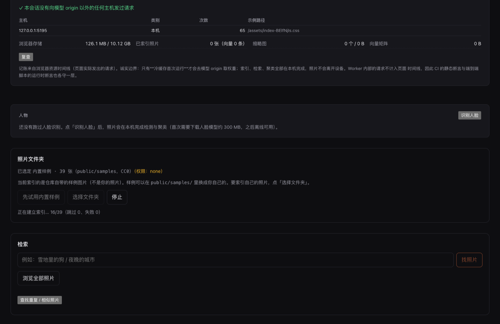
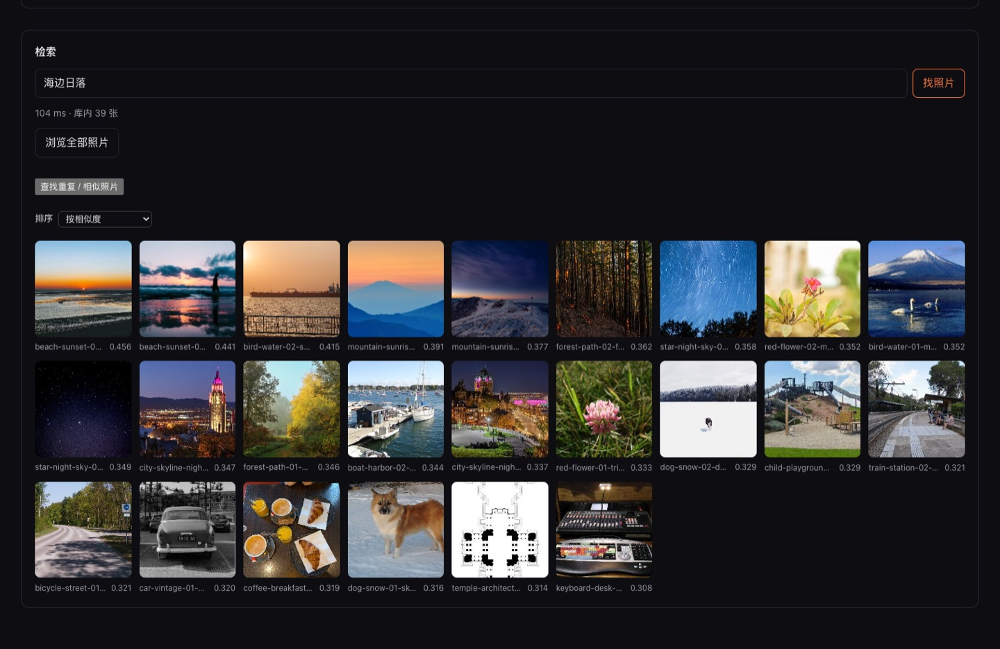
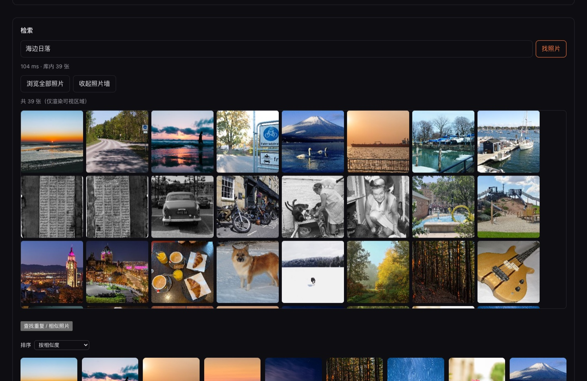
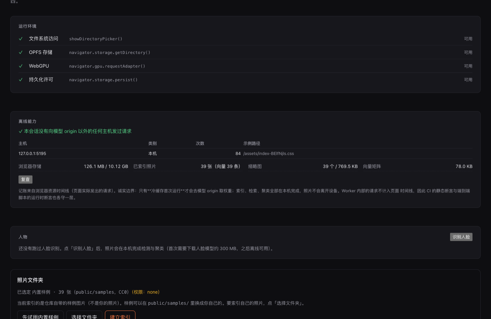

# Fstop（光圈）

[](LICENSE)
[](https://github.com/xqh-jason/fstop/actions/workflows/ci.yml)

[English](README.md) · **中文**

**跑在浏览器里的本地照片语义检索。选一个文件夹，让本机自己建索引，然后一句话找到任意一张照片 —— 照片不复制、不上传、不装任何东西，核心代码逐行可读。**

Fstop 是架在你**已有**照片库之上的检索层：它只持有文件句柄，不持有副本。它在桌面 Chromium 标签页里用 WebGPU 跑 CLIP 家族模型，索引写在浏览器自己的存储里。没有服务端、没有账号、没有 CUDA、没有 Docker，也不需要把照片搬进某个目录。

## 和现有方案的区别

| 方案                                                                        | 形态                                          | 与 Fstop 的关系                                                                                                    |
| --------------------------------------------------------------------------- | --------------------------------------------- | ------------------------------------------------------------------------------------------------------------------ |
| [MaterialSearch](https://github.com/chn-lee-yumi/MaterialSearch)（GPL-3.0） | Windows 打包程序 / Docker + GPU，同一模型家族 | 重叠最多。两点不同，也正是重点：① 它需要安装、挂载路径、还得有 GPU；② 它的核心闭源 —— API 实现不开放，前端刻意混淆 |
| [Immich](https://github.com/immich-app/immich)                              | 自托管服务端                                  | 需要服务端。数据留在你自己的网络里，但你仍然要运维一台机器                                                         |
| [PhotoPrism](https://github.com/photoprism/photoprism)                      | 自托管服务端                                  | 同上                                                                                                               |
| [rollfilm](https://github.com/pasqualkreher/rollfilm)（MIT, Electron）      | 桌面壳、隐私优先、支持 RAW                    | 形态相同，走 Electron 路线。它证明「桌面壳 + RAW」这条路有人要                                                     |
| semantic-file-explorer / CLIP-Finder2                                       | Swift / macOS 原生                            | 单平台、单生态                                                                                                     |

**性能不是这个项目的战场** —— 有 CUDA 的机器永远更快。Fstop 押的是另外三件事：**零安装、零拷贝、核心可审计**。所以下面的硬指标都不是速度。

## 先试一下

不用安装，也不用先交出任何文件夹 —— 构建产物里带了一个样例库。

```bash
pnpm install
pnpm dev            # 打开终端里打印的 localhost 地址
```

在「照片文件夹」卡片里点 **先试用内置样例**：应用会索引 `public/samples/` 下的 **39 张** CC0 / 公有领域照片，于是**不用授权任何目录**就能看到索引、检索、相似分组、人物面板与离线面板。之后再选自己的真实文件夹。

发布形态就是一个纯静态站点：`pnpm build` 产出自带一切的 `dist/`（ONNX Runtime 的 wasm 与 SQLite 的 wasm 都同源打包，模型权重运行时从模型 origin 取、由浏览器缓存），丢到任意静态托管上就能用。`pnpm build && node bench/e2e-samples.mjs` 会静态托管构建产物跑一遍端到端：样例索引、一次检索，以及「除模型 origin 外没有任何请求离开本机」—— 包括应用自己的 origin，它绝不该被算成违规。

打包发布物用 `pnpm release:package`：它会**剥掉派生的模型权重**并在产物里出现任何 `.onnx` 时直接失败（上游模型卡未授权再分发），同时生成 `SHA256SUMS` 与 `RELEASE.txt`。

## 截图

四张都取自**构建产物**（不是 dev server）—— 由 [`bench/shots.mjs`](bench/shots.mjs) 重新生成。

| 索引进行中（进度与在索引什么）         | 检索结果                                 |
| -------------------------------------- | ---------------------------------------- |
|  |  |

| 照片墙（铺满窗口宽度）               | 离线能力面板                              |
| ------------------------------------ | ----------------------------------------- |
|  |  |

## 硬指标

| 项目     | 目标                                                                                                                     |
| -------- | ------------------------------------------------------------------------------------------------------------------------ |
| 照片拷贝 | **0 字节**                                                                                                               |
| 外发请求 | **除模型权重下载外为零** —— 由 CI 与端到端断言强制，不靠肉眼看网络面板                                                   |
| 平台     | 桌面 Chromium（Chrome / Edge **113+**，必须有 WebGPU）。Firefox / Safari 缺目录选择器与 WebGPU；移动端在设计上不在范围内 |
| 核心     | `src/core/` 手写且有单测；索引与检索逻辑是给人读的                                                                       |

## 状态与实测

**M0（可行性）、M1（MVP）、M2（差异化功能）、M3（发布形态）均已收口。** 所有数字都可复跑，测量环境：macOS / 系统 Chrome 153（headless）/ 真实语料 783 张 Wikimedia CC0 原图（1.71 GB）。

- **索引吞吐**：默认双塔 13.6 张/秒（1 万张外推 12.3 分钟）；重导出的 192² 单塔 **18.56 张/秒（9.0 分钟）**，过了 10 分钟冲刺线。产品路径实测 200 张 **12.8 s = 15.6 张/秒**。
- **检索延迟**：文本编码 28 ms + 矩阵余弦 7.3 ms（预算 300 ms）。
- **检索质量**：中文 106 条 query、783 张库，192² 单塔 R@1 **46.2%**，与 224² 双塔的 48.1% 统计上不可区分（McNemar p = 0.774）；160² 掉 9.4 pp（p = 0.021），所以 **192² 是「掉得测不出来」的最大幅度**。
- **相似/重复图分组**：16 张（8 原片 + 各 1 复制品）→ 8 组 × 2 张、零误吸、1 ms。
- **人脸聚类与命名**：7 张标注肖像 → 7 张脸 → 恰好 2 组（4 + 3）、零混合组；同人余弦 0.506–0.995、异人 ≤ 0.031。人物面板的封面按「人脸长边铺满格子 + 人脸中心对齐格子中心」裁切，可见窗口与脸中心的偏差实测 0.0 px。
- **离线承诺**：应用内的离线能力面板记录浏览器**真实发出**的请求并按 host 归类，出现模型 origin 以外的 host 会红着点名；端到端脚本用请求钩子互证。
- **发布形态**：`dist/` 静态托管下 39 张样例全部索引、检索可用、自身 origin 不被误判为外发。

细节与复现命令见 [`docs/BENCHMARKS.md`](docs/BENCHMARKS.md)，设计取舍见 [`docs/DESIGN.md`](docs/DESIGN.md)。

## 文档

| 文件                                       | 内容                                           |
| ------------------------------------------ | ---------------------------------------------- |
| [`README.md`](README.md)                   | English README（与本文等价）                   |
| [`docs/DESIGN.md`](docs/DESIGN.md)         | 架构、每个决策与否掉的备选、必须守住的不变量   |
| [`docs/BENCHMARKS.md`](docs/BENCHMARKS.md) | 每一个实测数字、复现命令，以及被实测推翻的假设 |
| [`CHANGELOG.md`](CHANGELOG.md)             | 版本变更                                       |
| [`CONTRIBUTING.md`](CONTRIBUTING.md)       | 如何构建、测试、提交改动                       |
| [`SECURITY.md`](SECURITY.md)               | 威胁模型与漏洞上报方式                         |
| [`CODE_OF_CONDUCT.md`](CODE_OF_CONDUCT.md) | 贡献者行为准则（Contributor Covenant 2.1）     |
| [`NOTICE`](NOTICE)                         | 模型出处、许可与再分发限制                     |

## 功能

| 功能               | 说明                                                                                            |
| ------------------ | ----------------------------------------------------------------------------------------------- |
| 本地语义检索       | 文件夹句柄 → 解码 → WebGPU 嵌入 → OPFS 扁平 Float32 矩阵 + SQLite；索引期间即可检索             |
| 相似 / 重复图分组  | 阈值聚类 + 全链约束，展开才读缩略图                                                             |
| 结果重排           | 按相似度 / 最新 / 最早；拍摄时间优先，缺失时如实标「时间未知」而不是编一个                      |
| 人脸聚类与人物命名 | SCRFD 检测 → 5 点对齐 → ArcFace 512 维 → 全链约束聚类；界面上可命名 / 合并 / 拆分，名字活过重算 |
| 离线能力面板       | 记浏览器真发出的请求、按 host 分组、显示本地存储占用，违规 host 红着点名                        |
| 万张级照片墙       | 虚拟滚动 + 缩略图缓存（带 LRU 淘汰与 URL 回收）                                                 |
| 多标签页           | Web Locks 选主，第二个标签页退化成只读而不是报错                                                |

## 已知限制

- **Chromium 解不开 HEIC / RAW**：这是明确排除项，不是待办。
- **标签页关闭即停**：浏览器路线的固有短板，索引不会在后台继续。要常驻得上原生壳。
- **人脸语料只有 7 张、2 个人**：能证明「不混人、同人成组」，给不出召回率/准确率的量化结论。
- **首次运行要下模型权重**（默认档 47.5 MB）：首次慢、之后走浏览器缓存。
- 人脸封面的清晰度上限就是 320 px 缩略图的分辨率（脸只占原图 5% 时，缩略图里只有约 16 px）。

## 许可与使用限制（重要）

代码是 **MIT**。模型权重**不随仓库分发** —— 出处、许可与理由记录在 [`NOTICE`](NOTICE)。

人脸功能使用的识别模型 `immich-app/antelopev2` 采用 **insightface 的 `license: other`（非商用研究用途）**。这一条会传导到整个产品：**只要启用人脸识别，本项目就不得用于商业用途**。检测模型 `immich-app/scrfd_34g_gnkps` 是 MIT，不构成限制。界面（「人物」面板）与 `NOTICE` §2 都写明了这一点；若你需要商用，可以只用检索与相似分组（不点「识别人脸」），或自行替换为许可允许的人脸模型。

## 开发

```bash
pnpm install
pnpm dev          # 开发服务器
pnpm verify       # typecheck + lint + 静态零外发检查 + 单测
pnpm build        # typecheck + 生产构建
pnpm bench        # 吞吐 / 质量基准（需要真实语料，见 bench/corpus-manifest.json）
```

关键路径由端到端脚本覆盖（各自起浏览器与静态服务器，并断言运行时除模型 origin 外零外发）：

```bash
node bench/e2e-app.mjs      # 扫描 → 索引 → 检索 → 增量复扫 → 离线面板
node bench/e2e-wall.mjs     # 万张照片墙虚拟滚动
node bench/e2e-tabs.mjs     # 第二标签页退化成只读
node bench/e2e-similar.mjs  # 相似/重复图分组
node bench/e2e-faces.mjs    # 人脸检测 → 聚类 → 命名/合并/拆分 + 面板渲染
pnpm build && node bench/e2e-samples.mjs   # 构建产物静态托管 + 内置样例
```

要求 Node `>=22.22`（单测通过 `node:sqlite` 跑真实 schema）与 pnpm 11。贡献前请读 [`CONTRIBUTING.md`](CONTRIBUTING.md) 里的三条不可协商规则；行为准则见 [`CODE_OF_CONDUCT.md`](CODE_OF_CONDUCT.md)，安全问题的报法见 [`SECURITY.md`](SECURITY.md)，版本变更见 [`CHANGELOG.md`](CHANGELOG.md)。

1.0 之前 `src/core/` 的结构还会动。
